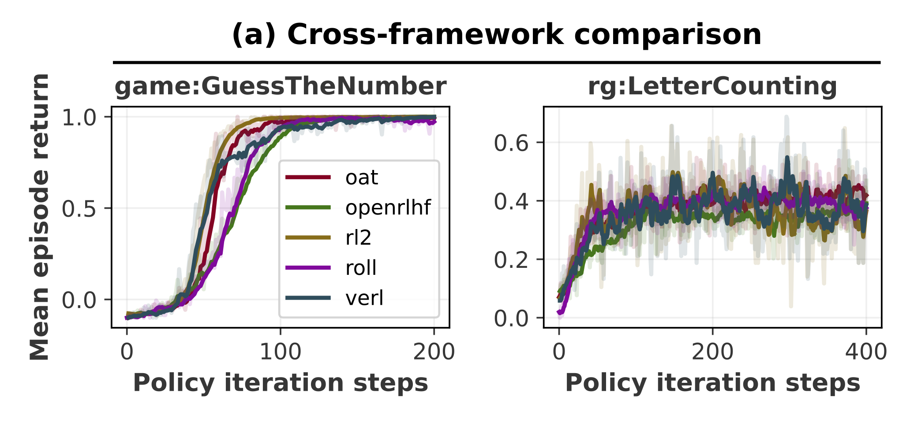

# RL2: Ray Less Reinforcement Learning

A concise library of post-training for large language models.

This is the right library for you if you want to learn reinforcement learning for large language models or have a quick test for your own algorithm.
We deliver a clear implementation without complicated abstractions.

Despite the simplicity, you should be able to scale up with 3D (DP/CP/TP) parallelism in FSDP backend and 5D parallelism (DP/CP/PP/TP/EP) in Megatron backend.
We also support

* Balanced sequence packing for higher throughput
* Multi-turn rollout with [SGLang](https://github.com/sgl-project/sglang) async inference engine
* [GEM](https://github.com/axon-rl/gem.git) (OpenAI Gym like) Agentic Environments

RL2 is a production-ready library!
It achieves comparable performance with other popular LLM RL libraries.
<p align="center">
  
</p>

Also check our wandb report on [OpenThoughts](https://wandb.ai/chenmientan/OpenThoughts_archive), [SkyworkRM](https://wandb.ai/chenmientan/SkyworkRM_archive), [UltraFeedback](https://wandb.ai/chenmientan/UltraFeedback_archive), [TinyZero](https://wandb.ai/chenmientan/Countdown_archive), [LetterCounting](https://wandb.ai/chenmientan/LetterCounting_archive), and [SearchR1](https://wandb.ai/chenmientan/SearchR1_archive).

## Incoming Features

- [X] Support Megatron backend to increase GPU utilization for Mixture-of-Expert
- [ ] Support Low-Rank Adaptation to decrease GPU memory comsumption
- [X] Initialize model on meta device to decrease RAM consumption
- [X] Support partial rollout to decrease GPU idle
- [X] Use SGLang Router to forward requests for load balance between inference engines
- [X] Integrate GEM to scale environments

## Getting Started

### Installation

**From PyPI:**
```bash
pip install rl-square
```

**Using Pre-built Docker Images:**
```bash
# FSDP backend only
docker pull rlsquare/rl2:latest

# Megatron backend (includes FSDP)
docker pull rlsquare/rl2-megatron:latest
```

### Data Preperation [[Examples]](https://huggingface.co/Chenmien/datasets)

Hugging Face dataset and various file types, *i.e.*, JSON, JSONL, CSV, Parquet, and Arrow, are accepted.
All trainers support formats of both raw text and messages.
The former is more flexible but may be model-specific.

#### SFT

```json
[
    {
        "prompt": "The capital of China is",
        "response": "Beijing."
    }
]
```
```json
[
    {
        "messages": [
            {"role": "user", "content": "What is the capital of China?"},
            {"role": "assistant", "content": "Beijing."}
        ]
    }
]
```
Multi-turn is only supported by the latter format.
#### RM and DPO
```json
[
    {
        "prompt": "The capital of China is",
        "chosen": "Beijing.",
        "rejected": "Shanghai."
    }
]
```

```json
[
    {
        "chosen": [
            {"role": "user", "content": "What is the capital of China?"},
            {"role": "assistant", "content": "Beijing."}
        ],
        "rejected": [
            {"role": "user", "content": "What is the capital of China?"},
            {"role": "assistant", "content": "Shanghai."}
        ]
    }
]
```
#### PPO
```json
[
    {
        "prompt": "The capital of China is",
        "extra_info": {
            "answer": "Beijing"
        }
    }
]
```
```json
[
    {
        "messages": [
            {"role": "user", "content": "What is the capital of China?"}
        ],
        "extra_info": {
            "answer": "Beijing"
        }
    }
]
```

### Environments [[Examples]](./envs)

In PPO, the language model interacts with the environment through a user-defined function `step` in the following format.
```python
async def step(
    state: str, action: str, extra_info: Dict
) -> Dict:
    action_type = parse_action_type(action)
    env_response = {
        "next_state": None,
        "reward": 0.0,
        "score": 0.0,
        "done": False,
        "extra_info": extra_info
    }
    if action_type == "search":
        query = parse_query(action)
        passage = await search_result(query)
        env_response["next_state"] = state + action + passage
    elif action_type == "answer":
        pred = parse_pred(action)
        reward = float(is_equivalent(pred, extra_info["answer"]))
        env["reward"] = reward
        env["score"] = score
        env_response["done"] = True
    return env_response
```
* `state` and `action` are the input and output of language model in the last turn and `next_state` is the input of language model in the next turn.
When `state + action` is a prefix of `next_state`, the two turns will be processed in a single sequence.
* `reward` is used to compute advantages (and subsequently update the model) while `score` is used to log the model performance.
Diverge values may be used when needed.
* `done` indicates whether to proceed to the next turn.
* `extra_info` contains everything not aforementioned, *e.g.*, answer.

The function should be included in a Python script where the path is specified by `actor.rollout.env_path`.

#### Multi-Agent PPO Environments

RL2 also supports multi-agent episodes without changing the actor update path. In phase 1, all agents share the same actor policy and the rollout is flattened back into per-agent training samples before PPO updates.

You may still provide a custom `generate(...)` function, but `env_path` can now also expose `reset(...)` and `step(...)` directly:

```python
async def reset(sample, tokenizer, extra_info, **kwargs) -> Dict:
    return {
        "agent_ids": ["planner", "solver"],
        "current_agent": "planner",
        "next_observations": {
            "planner": "...",
            "solver": "..."
        },
        "done_agents": [],
        "shared_info": {},
        "extra_info": extra_info
    }

async def step(
    state: str,
    action: str,
    extra_info: Dict,
    agent_id: str,
    agent_states: Dict[str, str],
    shared_info: Dict,
    **kwargs
) -> Dict:
    return {
        "current_agent": "solver",
        "next_observations": {
            "solver": "..."
        },
        "rewards": {
            "planner": 0.0,
            "solver": 1.0
        },
        "scores": {
            "planner": 0.0,
            "solver": 1.0
        },
        "done": False,
        "done_agents": ["planner"],
        "shared_info": {
            "global_reward": 1.0,
            "state_value_target": 1.0
        },
        "extra_info": extra_info
    }
```

Multi-agent response fields:

* `agent_ids`: all agent ids in the episode
* `current_agent`: the next agent to act; if omitted and `rollout.multi_agent.agent_order=turn_based`, RL2 will select the next unfinished agent in order
* `next_observations`: next prompt/message text for one or more agents
* `rewards`: per-agent immediate rewards
* `scores`: optional per-agent logging scores
* `done_agents`: agents whose trajectories are complete
* `shared_info`: shared episode state, team reward, or centralized critic targets
* `extra_info`: passthrough metadata from the dataset / environment

Relevant PPO config:

```yaml
rollout:
  env_path: envs/multi_agent_countdown.py
  multi_agent:
    enabled: true
    shared_policy: true
    reward_mode: individual # `individual`, `team`, `mixed`
    agent_order: turn_based # `turn_based`, `env_driven`

critic:
  use_centralized_value: false
```

See `envs/multi_agent_countdown.py` for a minimal shared-policy example.

`envs/multi_agent_countdown.py` is compatible with:

* the existing `Chenmien/Countdown` dataset fields (`prompt`, `numbers`, `target`)
* local PPO-style data containing `prompt` plus `extra_info.answer`

Minimal local JSON / JSONL example:

```json
[
    {
        "prompt": "Use 1, 3, 4, and 6 exactly once to make 24.",
        "numbers": [1, 3, 4, 6],
        "target": 24,
        "extra_info": {
            "answer": "(6 / (1 - 3 / 4))"
        }
    }
]
```

One-click launch on a cluster:

```bash
bash examples/multi_agent_countdown_reinforce.sh
```

The script defaults to `Chenmien/Countdown`, and you can override paths / cluster settings without editing the file:

```bash
TRAIN_PATH="/path/to/train.jsonl" \
TEST_PATH="/path/to/test.jsonl" \
MODEL_NAME="Qwen/Qwen2.5-7B-Instruct" \
NPROC_PER_NODE=8 \
NNODES=2 \
NODE_RANK=0 \
MASTER_ADDR="10.0.0.1" \
MASTER_PORT=29500 \
EXPERIMENT_NAME="qwen2.5-7b_multi_agent_countdown" \
bash examples/multi_agent_countdown_reinforce.sh
```

For SLURM clusters, you can submit the companion script directly:

```bash
sbatch examples/multi_agent_countdown_reinforce.slurm
```

Common SLURM overrides:

```bash
sbatch \
  --nodes=2 \
  --gres=gpu:8 \
  --job-name=rl2-ma-countdown \
  --export=ALL,TRAIN_PATH=/path/train.jsonl,TEST_PATH=/path/test.jsonl,MODEL_NAME=Qwen/Qwen2.5-7B-Instruct,EXPERIMENT_NAME=qwen2.5-7b_multi_agent_countdown \
  examples/multi_agent_countdown_reinforce.slurm
```

The SLURM script derives:

* `MASTER_ADDR` from the first hostname in `SLURM_JOB_NODELIST`
* `NODE_RANK` from `SLURM_NODEID`
* `NNODES` from `SLURM_NNODES`
* `NPROC_PER_NODE` from `SLURM_GPUS_ON_NODE` unless you override it manually

### Launch [[Examples]](./examples)

Use `torchrun` to launch the trainer. For example, for single node
```bash
torchrun \
    --nproc_per_node=<number of GPUs> \
    -m RL2.trainer.ppo \
    <args>
```
For multi nodes
```bash
torchrun \
    --nnodes=<number of nodes> \
    --node_rank=<rank of node> \
    --nproc_per_node=<number of GPUs on a node> \
    --master_addr=<address of master node> \
    --master_port=<port of master node> \
    -m RL2.trainer.ppo \
    <args>
```

## Hyper-Parameters

### Training Engine Partition

By default, *i.e.*, `ddp_size=1, tp_size=1`, your model will be partitioned via ZeRO stage 3.
`ddp_size` specifies the number of model parameter copies.
Larger `ddp_size` leads to higher memory consumption and lower communication cost.
For large models, you may specify `tp_size > 1` to enable tensor parallelism.
The product of `ddp_size` and `tp_size` should be a factor of the total number of GPUs.

### Sequence Length

For SFT, RM, and DPO, `max_length` is used to truncate sequences.
In RM and DPO, the chosen and rejected sequences will be packed together, so the actual sequence length can be up to twice of `max_length`.
For PPO, `max_new_tokens` is used to terminate generations.
The length of any sequence cannot exceed `cp_size * tp_size * max_length_per_device`.

### Algorithm

The default algorithm is [Dr. GRPO](https://arxiv.org/abs/2503.20783), where the loss is averaged at the token level and the advantage is not divided by the standard deviation.

* To use OpenAI PPO, set `kl.type=reward`, `kl.reward_estimator=k1`, and `adv.estimator=gae`
* To use DeepSeek GRPO, set `actor.avg_level=sequence`, `kl.type=loss`, `kl.loss_estimator=k3`, and `adv.norm_var=true`

## Acknowledgement

This project is built upon the basis of many remarkable projects, including but not limited to
* [DeepSpeedChat](https://github.com/deepspeedai/DeepSpeedExamples/tree/master/applications/DeepSpeed-Chat) for the proposal of hybrid engine
* [RingFlashAttention](https://github.com/zhuzilin/ring-flash-attention) for the support of ZigZag context parallelism
* [SGLang](https://github.com/sgl-project/sglang) for the support of async inference engine

We also thank [OpenRLHF](https://github.com/OpenRLHF/OpenRLHF), [veRL](https://github.com/volcengine/verl), and [slime](https://github.com/THUDM/slime) for their pioneering work.

## Citation
If you find this library useful, please cite in the following format
```latex
@misc{Tan2025RL2,
    author={Chenmien Tan and Simon Yu and Lanbo Lin and Ze Zhang and Yuanwu Xu and Chenhao Jiang and Tianyuan Yang and Sicong Xie and Guannan Zhang},
    title={RL2: Ray Less Reinforcement Learning},
    note={GitHub repository},
    howpublished={\url{https://github.com/ChenmienTan/RL2}},
    year={2025}
}
```

## Job Oppotunities

We are [Accio](https://www.accio.com/?src=p_GoogleDisplay_web&cmpgn=23138010880&adgrp=&fditm=&tgt=&locintrst=&locphyscl=1013962&mtchtyp=&ntwrk=x&device=c&dvcmdl=&creative=&plcmnt=&plcmntcat=&aceid=&position=&gad_source=1&gad_campaignid=23128156539&gbraid=0AAAAA-lIm6h93W5FT1DWH95ZQ28d5GT1N&gclid=Cj0KCQiAwYrNBhDcARIsAGo3u30JTZWSXpG4z0mrHg1E9y1ZaLOFYUI6hvWFNltm38VxLGBL-7MydRMaAnEZEALw_wcB), the world's first AI sourcing agent.
We are always looking for talents in Hangzhou.
Send us an [email](mailto:sicong.xsc@alibaba-inc.com) if you are interested in internship/full-time positions in post-training/agent.